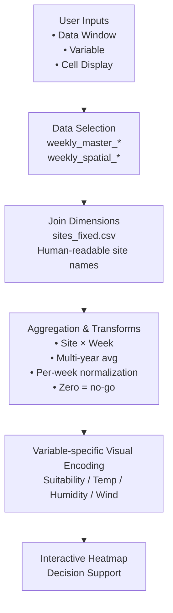

```mermaid
flowchart TD
    A[User Inputs<br/>• Data Window<br/>• Variable<br/>• Cell Display] --> B[Data Selection<br/>weekly_master_*<br/>weekly_spatial_*]
    B --> C[Join Dimensions<br/>sites_fixed.csv<br/>Human-readable site names]
    C --> D[Aggregation & Transforms<br/>• Site × Week<br/>• Multi-year avg<br/>• Per-week normalization<br/>• Zero = no-go]
    D --> E[Variable-specific Visual Encoding<br/>Suitability / Temp / Humidity / Wind]
    E --> F[Interactive Heatmap<br/>Decision Support]
```
